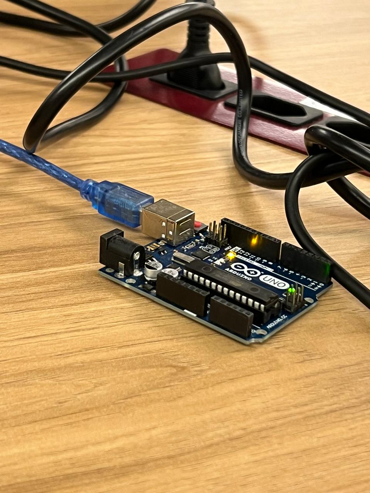

# Parte 1: Blink Led Interno

<figure>
  <figcaption>Código utilizado no IDE do Arduino</figcaption>
  
</figure>

<figure>
  <figcaption>Led Ligado no arduino </figcaption>
  
</figure>

<figure>
  <figcaption>Led Ligado no tinkercad</figcaption>
  
</figure>

# Parte 2: Piscando um LED

<figure>
  <figcaption>Led Ligado no tinkercad</figcaption>
  
</figure>

<figure>
  <figcaption>Led Ligado no tinkercad</figcaption>
  
</figure>
